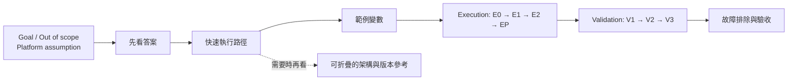

# Istio Cross-Cluster SOP 寫作規格與編輯基準

這份文件記錄〈Istio Multi-Primary Same Network：從 c1 透過 Internal Service 存取只存在 c2 的 Workload〉在討論過程中形成的寫作決策。它不是另一份操作手冊，而是之後修改中英文稿時應遵守的編輯基準。

## 先看答案

| 面向 | 已確立的寫作決策 |
|---|---|
| 主要讀者 | Junior DevOps／應用團隊 DevOps；知道基本的 Kubernetes 與 `kubectl`，但不假設熟悉 Istio multicluster 內部原理 |
| 文章目的 | 讓讀者依 SOP 完成「c1 呼叫本地 internal Service FQDN，實際抵達只存在 c2 的 workload」並能自行驗收 |
| 開場方式 | 先用精簡 callout 交代 Goal、Out of scope 與 Platform assumption，緊接著給答案與最短執行路徑；不要先用長篇架構、版本矩陣或背景知識阻擋讀者 |
| 步驟編排 | 執行與驗證分開：先列 E0、E1、E2、條件式 EP，再列 V1、V2、V3 |
| 責任邊界 | 平台已準備好的 mesh、跨叢集路由與 remote endpoint discovery 是「假設」，不是應用 DevOps 的日常 preflight |
| 圖表原則 | 表格用來比較與核對；Mermaid 只在關係或判斷流程真的較難用文字說清楚時使用 |
| 顏色原則 | 顏色必須有語意且全文一致；沒有需要傳達的語意就不著色 |
| 雙語原則 | 中文版與英文版必須保持相同資訊、章節順序、命令、圖表與驗收條件；只允許語言本地化差異 |

## 一、讀者與文件契約

### 1.1 讀者已知與未知

| 可假設讀者知道 | 不應假設讀者知道 |
|---|---|
| Namespace、Service、Deployment、Pod、ServiceAccount | Istio 如何合併跨叢集 Service endpoint |
| 基本 `kubectl get/apply/logs/exec` | DNS 回傳 ClusterIP，但 Envoy 實際選擇 c2 Pod IP 的差異 |
| 如何替換 YAML 與 shell placeholder | `clusterLocal`、`exportTo`、`Sidecar.egress.hosts` 的影響 |
| 如何辨識 Pod 是否 Ready | Auto mTLS、PeerAuthentication 與 AuthorizationPolicy 的互動 |
| 自己應用的 namespace、label、port 與 image | 平台端 multicluster secret、網路標籤或 istiod remote sync 細節 |

每個不直覺的 Istio 行為，第一次出現時都應補一句「為什麼」。說明應緊貼操作，不把 Junior DevOps 丟去背景章節自行拼湊因果。

### 1.2 讀完後必須能回答的問題

| 問題 | 文件必須提供的明確答案 |
|---|---|
| c1 為何也要建立 Service？ | 讓本地 DNS 名稱與 ClusterIP 存在，並提供 sidecar 可攔截的服務身分 |
| workload 為何只放 c2？ | 這正是要驗證的目標拓撲；c1 不應出現同 label 的 workload |
| request 最後連到哪裡？ | c1 sidecar 從 Istio endpoint 資訊選出 c2 Pod IP，same network 下直接 Pod-to-Pod |
| c1 EndpointSlice 是空的是否異常？ | 正常；應查看 c1 caller Envoy 是否收到 c2 endpoint |
| 要不要 ServiceEntry、VirtualService 或 east-west gateway？ | 這個 same-network、同 mesh 的基本流程不需要 |
| 如何證明成功？ | DNS、c2 EndpointSlice、c1 Envoy endpoint、HTTP 回應與 c2 server log 五項證據互相吻合 |

## 二、技術先決條件與責任邊界

這些條件決定 SOP 是否成立。文章必須把它們寫成清楚的文件契約，但不要全部變成 Junior DevOps 的逐項平台檢查命令。

### 2.1 平台先決條件

| 先決條件 | 文件中的呈現方式 | 不成立時的處理 |
|---|---|---|
| c1、c2 是 multi-primary、same network、single mesh | 與 Goal、Out of scope 放在同一個精簡開場 callout group，位於「先看答案」之前 | 停止套用本 SOP，交由平台團隊確認拓撲 |
| 兩邊 Pod IP 可直接路由，必要的 firewall／Security Group 已放行 | 視為平台假設，不列為一般 preflight | timeout 且 Envoy 已有 c2 Pod IP 時，升級給平台團隊 |
| 兩個 control plane 已完成 remote endpoint discovery | 視為平台假設 | c1 Envoy 沒有 c2 endpoint，排除應用設定後升級給平台團隊 |
| mesh trust、CA 與 network label 設定正確 | 放在 TLS／gateway 異常的故障排除 | 由平台團隊修正，不要求應用 DevOps 重建 mesh |
| c1、c2 同一 mesh 內的 Istio minor version 相容 | 版本章節明示 | 不可把 1.13.5、1.24.0、1.29.4 當成同一 mesh 的混搭範例 |

### 2.2 應用 DevOps 負責的條件

| 條件 | 最小檢查／操作 |
|---|---|
| 可使用 c1、c2 kube context 且 RBAC 足夠 | 用 `kubectl auth can-i` 核對本 SOP 需要的操作 |
| 兩邊 Service 身分一致 | 比對 namespace、name、port number、port name、protocol；不要要求 ClusterIP 相同 |
| c2 Service selector 選得到 workload | 比對 label，並以 EndpointSlice 驗證 ready endpoint |
| c1 沒有目標 workload | `kubectl get pod -l app=...` 應顯示沒有資源 |
| c2 有 ready workload | Pod Ready、EndpointSlice `ready: true` |
| `clusterLocal`、`exportTo`、Sidecar egress scope 不阻擋 | 只在 endpoint 不可見時進入相應故障排除 |
| 若有 AuthorizationPolicy，放行正確 caller identity | principal 使用實際 trust domain、namespace 與 ServiceAccount |

### 2.3 Sidecar 是本情境的成立條件

文章不能只用 `2/2 Running` 暗示 sidecar 存在；必須明確檢查兩端 container name，並說明缺少 sidecar 的後果。

| c1 caller sidecar | c2 server sidecar | 對本 SOP 的判定 | 原因／限制 |
|:---:|:---:|---|---|
| 有 | 有 | ✅ 目標情境成立 | c1 Envoy 可選擇 remote EDS endpoint；c2 Envoy 可處理 inbound mTLS、policy 與 telemetry |
| 無 | 有 | ❌ 不成立 | c1 沒有 Envoy 可把本地 Service 身分映射到 c2 endpoint；本地 Kubernetes Service 又沒有可用 endpoint |
| 有 | 無 | ⚠️ 不視為驗收通過 | 在特定 PERMISSIVE／Auto mTLS 條件下 plaintext HTTP 可能碰巧成功，但沒有完整的 inbound Istio mTLS、policy 與 telemetry |
| 無 | 無 | ❌ 不屬於本 SOP | 這會變成一般 Kubernetes／網路問題，無法靠本地 ClusterIP 自動選到 c2 workload |

> **待補入英文成稿的內容：** E2 應新增 c2 Pod container name 檢查，並以 fail-fast 語句要求缺少 `istio-proxy` 時先修正 injection、重新建立 Pod，再繼續驗證。中文版已有雙端 sidecar 概念，但仍應與新版結構一起重新核對。

## 三、資訊揭露順序

讀者應在前兩個畫面內知道「要做什麼」；完整原理與版本參考可以稍後展開。

| 順序 | 區塊 | 寫作要求 |
|---:|---|---|
| 1 | Goal／Out of scope／Platform assumption | 以同一組簡短 callout 各用一句話描述可觀察的成功結果、排除 mesh 安裝教學，並明示平台已準備 same-network routing 與 remote endpoint discovery；這個區塊後面立刻接「先看答案」 |
| 2 | 先看答案 | 用三至五列回答核心設定、原因與預期資料流，不先堆背景 |
| 3 | 快速執行路徑 | 只列 phase、動作、成功條件與詳細章節連結 |
| 4 | 範例名稱與變數 | 集中列出 context、namespace、service、port、pod、ServiceAccount；不要讓 placeholder 散落全文 |
| 5 | Execution | E0 存取與 caller sidecar、E1 Service、E2 c2 workload、條件式 EP policy |
| 6 | Validation | V1 c2 Kubernetes endpoint、V2 c1 Envoy endpoint、V3 end-to-end request |
| 7 | Troubleshooting | 依證據鏈排序：DNS → Envoy endpoint → TCP → policy → readiness／TLS → application |
| 8 | Final checklist | 每一列都必須能用前文命令或輸出客觀證明 |
| 9 | Reference | 版本、原理、官方連結；長內容可折疊，避免阻擋主線 |

### 必須避免的編排

| 不要這樣寫 | 原因 | 改法 |
|---|---|---|
| 在答案前先放 Who／What／Why 與長版版本矩陣 | Junior 讀者尚未知道要做什麼，容易在背景資訊中迷路 | 先看答案與 quick path 放最前；背景移到可折疊 reference |
| 每做一步就插入很長的驗證與故障排除 | 主線被切碎，看不出總共有幾步 | 先完整揭露 execution，再集中 validation |
| Quick path 使用 Step 1，但詳細章節改稱其他編號 | anchor 與心智模型不一致 | 全文固定 E0/E1/E2/EP 與 V1/V2/V3 |
| 用「應該可以」取代具體輸出 | 無法驗收 | 寫出預期 Pod 數、container、IP 類型、HTTP 結果與 log 證據 |

## 四、步驟的固定寫法

每個 execution 或 validation 章節盡量使用同一骨架，降低 Junior 讀者的認知負擔。

| 欄位 | 內容 |
|---|---|
| 目的 | 這一步要建立或證明什麼 |
| 命令／YAML | 可直接複製；變數與 placeholder 定義完整 |
| 預期結果 | 用表格列 c1 與 c2 的不同結果 |
| 為什麼 | 只說明當下不直覺的機制 |
| Fail fast | 哪個結果出現時不得繼續 |
| 下一步 | 指向下一個 phase 或對應 troubleshooting |

命令與範例還應遵守以下規則：

| 規則 | 寫作注意 |
|---|---|
| Context 明確 | 每個跨叢集 `kubectl` 命令都帶 `--context`，避免在錯誤叢集操作 |
| Namespace 明確 | namespace-scoped 命令都帶 `-n` 或 manifest `metadata.namespace` |
| Placeholder 可辨識 | 使用 `<...>`，並在命令前提醒必須替換；不可讓讀者照貼 literal placeholder |
| 版本差異就地提醒 | 例如 AuthorizationPolicy 在 1.13.5 使用 `v1beta1`，在 1.24.0／1.29.4 使用 `v1` |
| 讀寫權限不混淆 | 平台唯讀診斷與應用變更權限分開描述 |
| 不用模糊縮寫 | FQDN、EDS、mTLS 第一次出現時說明它在本步驟扮演的角色 |

## 五、表格、Mermaid 與顏色

### 5.1 何時用什麼

| 資訊類型 | 建議形式 | 例子 |
|---|---|---|
| 多欄位核對、版本差異、症狀對照 | 表格 | Service identity、版本支援矩陣、troubleshooting matrix |
| 資料流、時序、分支判斷 | Mermaid | DNS → Envoy → c2 Pod；故障排除 decision tree |
| 單一提醒或阻擋條件 | 短 callout | 不要在 same network data path 放 east-west gateway |
| 線性一至三步 | 文字或編號 | 不為了裝飾硬加圖 |

### 5.2 顏色語意

| 顏色 | 固定語意 | 建議色碼 | 可使用的位置 |
|---|---|---|---|
| 藍色 | c1 | fill `#E8F1FB`、stroke `#2563EB` | 資料流中的 c1 元件 |
| 綠色 | c2 | fill `#E8F5E9`、stroke `#2E7D32` | 資料流中的 c2 元件 |
| 灰色 | Istio control-plane／中性資訊 | fill `#F3F4F6`、stroke `#6B7280` | service registry、一般判斷節點 |
| 紅色 | 已觀察到的失敗／必須停止 | fill `#FEE2E2`、stroke `#DC2626` | troubleshooting 起點或 fail-fast |
| 琥珀色 | 待執行的修正動作／重要限制 | fill `#FEF3C7`、stroke `#D97706` | troubleshooting action |

同一張圖下方必須附 color key。不要使用沒有定義的紫色、粉色或多色漸層，也不要只為了「看起來豐富」替每個節點上不同顏色。若圖中沒有 cluster、狀態或責任的語意差異，保留預設中性色即可。

## 六、版本資訊的寫法

版本表必須把「功能可用」與「仍受官方維護」拆開，避免讀者把能運作誤認為適合繼續用於 production。

| 版本 | SOP 寫作重點 |
|---|---|
| Istio 1.13.5 | 核心 flow 可成立；AuthorizationPolicy 使用 `security.istio.io/v1beta1`；明確標示 EOL 與升級風險 |
| Istio 1.24.0 | 核心 flow 與 `security.istio.io/v1` 可用；標示已 EOL，且不建議停留在 `.0` patch |
| Istio 1.29.4 | 可直接依新版範例使用；維護狀態與建議須帶 assessment date，避免內容過期 |

其他必要規則：

- 支援狀態一定附「評估日期」。
- 同時列出對應 Kubernetes 支援範圍，但不要讓版本表擋在 quick path 前。
- `istioctl` 應與目標 Istio minor version 對應。
- 不暗示 1.13.5、1.24.0、1.29.4 可在同一 mesh 內任意混跑。
- 技術聲明優先連到 Istio 官方文件、release notes 與 supported releases，不依賴二手文章。

## 七、中英文一致性

目前維護的兩個檔案如下：

| 語言 | 檔案 | 目前角色 |
|---|---|---|
| 中文 | `istio-multi-primary-same-network-c1-to-c2-internal-service.md` | 尚待同步的舊結構版本 |
| 英文 | `istio-multi-primary-same-network-c1-to-c2-internal-service-en.md` | **目前的結構基準（canonical editorial source）** |

英文稿的資訊架構較新，中文版仍保留舊的 Step 0–6 排序與較長的開場，因此兩份文件不是逐段等價。在中文版完成同步前，以英文稿決定章節順序、phase 編號與資訊揭露方式；技術內容若有疑義仍須用官方文件驗證，不能因它是主稿就視為永遠正確。完成首次同步後，兩版預設採 lockstep 維護：任何實質修改都在同一輪更新兩份檔案。只有使用者明確要求單語修改時才能例外，且交付時必須明示另一版尚未同步；不得因時間方便自行省略其中一版。

| 必須一致 | 可本地化 |
|---|---|
| Goal、scope、平台假設 | 句型與自然語序 |
| 章節順序與 E/V phase 編號 | 中文／英文標點 |
| YAML、shell command、變數名稱 | callout 的自然措辭 |
| 版本支援結論與 assessment date | 連接詞與說明長度的小幅調整 |
| Sidecar 成立條件與 fail-fast 判定 | 標題在不改變意義下的翻譯 |
| Mermaid 節點、邊、顏色語意 | 圖內文字語言 |
| Troubleshooting 分支與 final checklist | 讀者友善的補充例句 |

### 雙語修改流程

1. 首次同步完成前，先修改目前的英文結構基準，記錄新增、刪除與重新排序的區塊，再回寫中文版。
2. 對照另一語言稿的 heading、table row、code block、Mermaid edge 與 checklist item。
3. 確認內部 anchor 仍能抵達正確章節。
4. 用 diff 檢查「結構差異」，再由人檢查「語意差異」。
5. 首次同步完成後，同一輪更新兩版；只有使用者明確指定單一語言時才只改其中一版，並在工作紀錄與交付說明中標示另一版尚未同步。

## 八、故障排除與升級原則

故障排除要依「最近的一個已知正確證據」前進，且明確指出責任歸屬。

| 證據點 | 失敗時先查 | 責任歸屬 |
|---|---|---|
| c1 DNS 找不到 Service | c1 Service、namespace、FQDN | 應用 DevOps |
| c2 EndpointSlice 沒有 ready Pod IP | selector、readiness、targetPort | 應用 DevOps |
| c1 Envoy 沒有 c2 endpoint | Service identity、`exportTo`、`clusterLocal`、sidecar | 應用先查；remote sync 再升級平台 |
| c1 Envoy 有 c2 Pod IP但 timeout | application NetworkPolicy | 應用負責自身 policy；route／firewall 升級平台 |
| HTTP 403 | AuthorizationPolicy 與 source principal | 應用／policy owner |
| TLS、CA、gateway IP 或 network-label 異常 | PeerAuthentication、trust、mesh topology | 平台團隊 |
| HTTP 已到 c2 但應用回錯 | path、timeout、application log | 應用團隊 |

不要叫 Junior DevOps 修改 mesh topology 來「試試看」，也不要用 LoadBalancer、NodePort 或 east-west gateway 暫時繞過問題，因為那會改變原本要驗證的架構。

## 九、發布前檢查表

### 內容與技術

| Status | 檢查項目 |
|:---:|---|
| ⬜ | 開頭在短篇幅內同時揭露答案與 quick execution path |
| ⬜ | 平台假設和應用 DevOps 的操作責任已分開 |
| ⬜ | c1 caller 與 c2 server 的 `istio-proxy` 都有明確檢查與 fail-fast |
| ⬜ | Service identity 說明不要求兩邊 ClusterIP 相同 |
| ⬜ | Execution 與 Validation 分開且編號一致 |
| ⬜ | 每個驗證都列出可觀察的 expected result |
| ⬜ | 版本差異、EOL 與 assessment date 都存在 |
| ⬜ | 故障排除能分辨應用責任與平台升級點 |
| ⬜ | 最終 checklist 的每一項都可由前文證據驗證 |

### 文件品質

| Status | 檢查項目 |
|:---:|---|
| ⬜ | Quick path 的連結與實際 heading anchor 完全一致 |
| ⬜ | 中文版與英文版的章節、命令、表格、圖與驗收語意一致 |
| ⬜ | Mermaid 只在能提升理解時使用 |
| ⬜ | 每個 Mermaid 顏色都有固定語意與 legend；無裝飾性多色 |
| ⬜ | 所有 `<...>` placeholder 都已說明，沒有容易被照貼的假值 |
| ⬜ | Code fence 成對、YAML 可解析、shell 命令沒有明顯斷行錯誤 |
| ⬜ | 官方連結仍可用，技術聲明沒有依賴過期版本資訊 |
| ⬜ | 由沒有參與編寫的讀者測試：能否只靠本文說出步驟、成功證據與升級時機 |

## 十、目前文件的已知待辦

| 優先級 | 待辦 | 原因 |
|:---:|---|---|
| 高 | 在英文稿 E2 明確檢查 c2 server 的 `istio-proxy`，並補上雙端 sidecar 判定表或等價說明 | 現在 c1 是明確檢查，c2 主要仍靠 `2/2 Running` 暗示 |
| 高 | 讓中文版同步英文稿的「先看答案 → quick path → execution → validation」結構 | 目前兩版排版與讀者路徑有實質差異 |
| 中 | 同步中英文的 platform assumption 與升級責任 | 避免 Junior DevOps 被要求檢查平台已準備的 same-network routing 與 remote sync |
| 中 | 每次修改後重跑 anchor、code fence、Mermaid 與雙語 parity 檢查 | 防止局部編輯造成導覽或內容漂移 |

## 一句話編輯原則

> 先讓 Junior DevOps 看懂答案與最短操作路徑，再用可驗證的證據、明確的責任邊界與按需展開的原理解釋，協助他安全完成任務。
