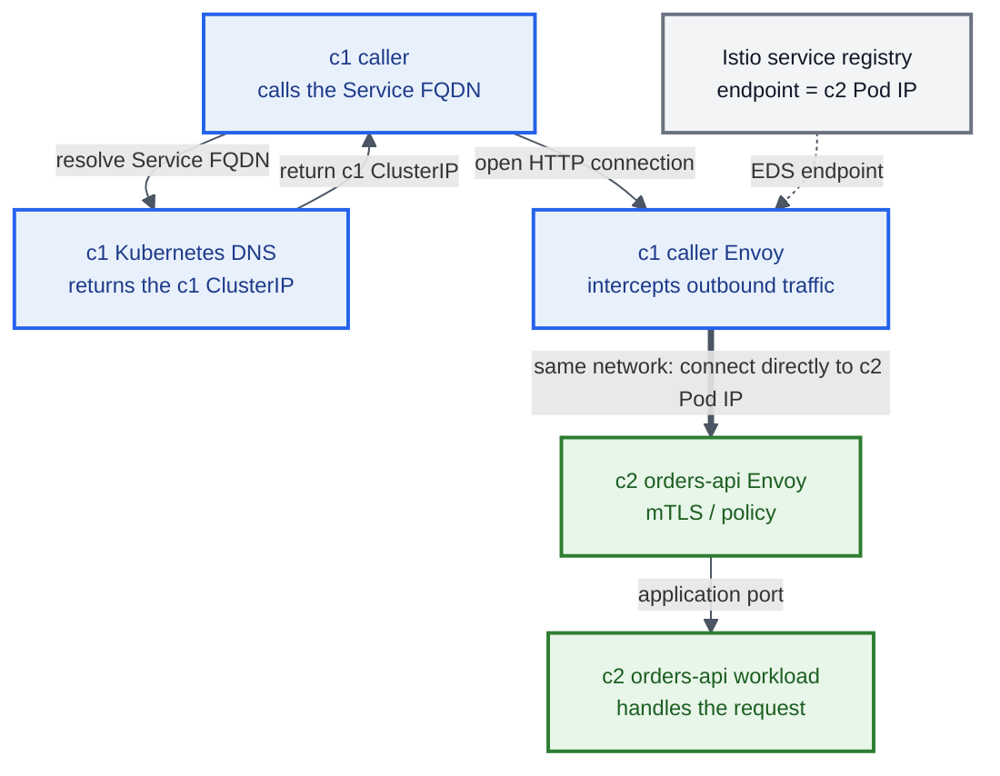
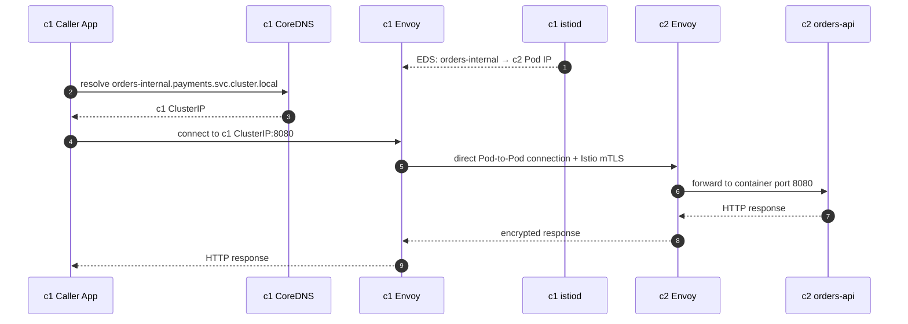
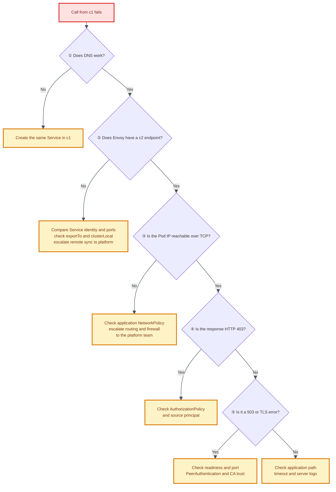

# Istio Multi-Primary, Same Network: Accessing a c2-Only Workload from c1 Through an Internal Service

> 🎯 **Goal:** An application in c1 calls the internal address `orders-internal.payments.svc.cluster.local:8080`, and the request reaches an `orders-api` Pod deployed only in c2.
>
> 📌 **Out of scope:** This runbook does not explain how to install an Istio multiple-primary mesh. It assumes that the mesh is already running and focuses only on the SOP, validation steps, and troubleshooting needed to achieve the goal.

## The Short Answer

| # | Configuration answer | Why it is needed |
|---:|---|---|
| 1 | Create the same `orders-internal` ClusterIP Service in c1 and c2 | The c1 Service provides local DNS and a ClusterIP interception point; the c2 Service selects and registers the workload endpoints |
| 2 | Deploy `orders-api` only in c2 | Every healthy endpoint for this service should belong to c2 |
| 3 | Call the Service FQDN from c1 and let the caller's Envoy select the c2 Pod IP | The c1 ClusterIP is not routed to c2; Envoy chooses the remote endpoint from the Istio service registry |

**Expected outcome:** DNS returns the c1 ClusterIP, while the actual request is sent directly from the c1 Envoy to a c2 Pod IP.

## Quick Execution Path — Run This Next

After reading the answer above, use this short path before opening command output and troubleshooting details. The detailed sections keep **execution** and **validation** separate.

### Execution Steps

| Phase | Do this | Detailed section |
|---:|---|---|
| **E0 — Access** | Confirm that both kube contexts are usable and the c1 caller has an Istio sidecar | [Execute E0](#execute-e0-confirm-access-and-caller-sidecar) |
| **E1 — Service** | Apply the same `orders-internal` ClusterIP Service manifest to c1 and c2 | [Execute E1](#execute-e1-create-the-internal-service) |
| **E2 — Workload** | Deploy `orders-api` only in c2 and wait for it to become ready | [Execute E2](#execute-e2-create-the-workload-in-c2) |
| **EP — Policy, if enforced** | Apply an AuthorizationPolicy in c2 that allows the c1 caller ServiceAccount | [Execute EP](#execute-ep-apply-authorizationpolicy-when-required) |

Do not create a ServiceEntry, VirtualService, LoadBalancer, NodePort, or east-west gateway for this same-network flow.

### Validation Pass

Run validation only after the execution steps are complete:

| Check | Confirm | Detailed section |
|---:|---|---|
| **V1 — c2 Kubernetes** | The c2 EndpointSlice contains ready `orders-api` Pod IPs | [Validate V1](#validate-v1-check-c2-kubernetes-endpoints) |
| **V2 — c1 Envoy** | The caller's Envoy has healthy endpoints matching those c2 Pod IPs | [Validate V2](#validate-v2-check-c1-envoy-endpoints) |
| **V3 — End to end** | The Service FQDN resolves to the c1 ClusterIP, the HTTP request succeeds, and the request appears in the c2 server log | [Validate V3](#validate-v3-run-the-end-to-end-request) |

> **Fast reading order:** The Short Answer → Quick Execution Path → [Example Names](#example-names-used-in-this-sop) → Execute E0, E1, E2, and EP when required → Validate V1, V2, and V3. Open the version and architecture reference only when needed.

## Example Names Used in This SOP

Map these example values to your environment before you continue. All later commands use these values.

| Item | Example value | What to verify |
|---|---|---|
| c1 kube context | `cluster1` | The cluster that contains the caller |
| c2 kube context | `cluster2` | The cluster that contains the workload |
| Service namespace | `payments` | **Must be identical in both clusters** |
| Service name | `orders-internal` | **Must be identical in both clusters** |
| Service port | `8080`, named `http` | **Both the port number and name must match** |
| Workload label | `app: orders-api` | The c2 Service selector must match it |
| Caller ServiceAccount | `frontend-sa` | Replace it with the c1 caller Pod's actual ServiceAccount |
| Full Service FQDN | `orders-internal.payments.svc.cluster.local` | Use the FQDN when the caller is in another namespace |

```bash
export CTX_C1=cluster1
export CTX_C2=cluster2
export SERVICE_NS=payments
export SERVICE_NAME=orders-internal
export SERVICE_PORT=8080
export CALLER_NS=frontend
export CALLER_POD=<c1-caller-pod-name>
export CALLER_SA=<c1-caller-service-account>
```

> 🟡 Values inside `<...>` are placeholders. Replace them with real values before running the commands.

<details>
<summary><strong>Architecture and version reference — expand when needed</strong></summary>

## Who / What / Where / Why / When

| Question | Plain-English answer |
|---|---|
| **Who** | The caller Pod and caller sidecar in c1, c1 istiod, and the `orders-api` Pod in c2 |
| **What** | Call a remote-cluster workload by using a Kubernetes internal Service name |
| **Where** | DNS and the ClusterIP exist in c1; the only workload and actual endpoints exist in c2 |
| **Why** | Kubernetes DNS only knows about Services in its own cluster. Istio can merge endpoints for Services with the same name and namespace across one mesh |
| **When** | Use this pattern with `multi-primary + same network + single mesh`, when Pod IPs in the two clusters can communicate directly |

## Istio Version Support Matrix

> 📅 **Assessment date: 2026-08-13**
>
> The tables below evaluate two separate concerns: whether the SOP is functionally compatible and whether the Istio community still provides security fixes for the release. **A working feature does not mean that the release is still suitable for production.**

### Quick Assessment

| Istio version | Core cross-cluster flow | Can this SOP be used directly? | Required changes | Official maintenance status | Recommendation |
|---|:---:|:---:|---|---|---|
| **1.13.5** | 🟢 Supported | 🟡 Supported with changes | In Execute EP, change `AuthorizationPolicy` to `security.istio.io/v1beta1`; use the 1.13.5 `istioctl` binary | 🔴 EOL since 2022-10-12 | Keep only for legacy operations. Schedule an upgrade, and do not ignore security risk simply because the SOP still works |
| **1.24.0** | 🟢 Supported | 🟢 Supported | No YAML changes; use the 1.24.0 `istioctl` binary | 🔴 EOL since 2025-06-24 | Functionally usable, but do not remain on a `.0` patch. Upgrade to a currently supported minor release |
| **1.29.4** | 🟢 Supported | 🟢 Supported | None; use the 1.29.4 `istioctl` binary and consider updating to the latest 1.29 patch | 🟢 Supported as of the assessment date; expected EOL around 2026-08 | Best of these three versions for direct use. Prepare the next minor upgrade at the same time |

Status legend: 🟢 available/supported; 🟡 requires changes or has important limitations; 🔴 no longer officially maintained.

### Feature-by-Feature Compatibility

| Capability required by this SOP | 1.13.5 | 1.24.0 | 1.29.4 |
|---|:---:|:---:|:---:|
| Multi-primary, same-network endpoint discovery | ✅ | ✅ | ✅ |
| Merging Services with the same name and namespace | ✅ | ✅ | ✅ |
| Creating local Service objects in both clusters for DNS and endpoint registration | ✅ | ✅ | ✅ |
| Direct Pod-to-Pod traffic on the same network | ✅ | ✅ | ✅ |
| `istioctl proxy-config endpoints --cluster ...` | ✅ | ✅ | ✅ |
| Service annotation `networking.istio.io/exportTo` | ✅ | ✅ | ✅ |
| `MeshConfig.serviceSettings[].settings.clusterLocal` | ✅ | ✅ | ✅ |
| `AuthorizationPolicy` fields `principals` and `ports` | ✅ | ✅ | ✅ |
| `security.istio.io/v1` | ❌ | ✅ | ✅ |
| The sidecar-based validation method in this SOP | ✅ | ✅ | ✅ |

> **How to read this matrix**
>
> - All three releases allow istiod to observe remote-cluster endpoints and merge Services with the same name and namespace.
> - Kubernetes DNS remains local to each cluster. The c1 Service provides the caller's DNS name and ClusterIP interception point; the c2 Service selects and registers the c2 workload endpoints.
> - On a same-network deployment, the caller's Envoy should see a c2 Pod IP, not an east-west gateway IP.
> - All three releases support the caller-side Envoy endpoint checks in this SOP.
> - `security.istio.io/v1` became available in Istio 1.22. On 1.13.5, `AuthorizationPolicy` must use `v1beta1`.
> - This is a sidecar-mode SOP, not an ambient-mode SOP.

### Check Kubernetes Compatibility Too

| Istio | Kubernetes versions supported at the time | Impact on this SOP |
|---|---|---|
| 1.13.x | 1.20–1.23 | If your actual Kubernetes version is much newer, the overall combination is unsupported even if the SOP appears to work |
| 1.24.x | 1.28–1.31 | You can use `kubectl get endpointslice` directly |
| 1.29.x | 1.31–1.35 | `1.29.4+` is currently listed among patches without known CVEs; still track the latest patch in the same minor release |

> 🔴 **Do not mix the 1.13.5, 1.24.0, and 1.29.4 control planes in one multi-primary mesh.** The table assumes that these are three separate environments. Istio supports only limited control-plane/data-plane skew. A c1/c2 combination spanning several minor releases is unsupported. If c1 and c2 belong to the same mesh, align them to the same minor release first and preferably to the same patch release.

### AuthorizationPolicy API by Version

```yaml
# Istio 1.13.5
apiVersion: security.istio.io/v1beta1
kind: AuthorizationPolicy
```

```yaml
# Istio 1.24.0 and 1.29.4
apiVersion: security.istio.io/v1
kind: AuthorizationPolicy
```

Apart from `apiVersion`, the `selector`, `principals`, and `ports` rules in Execute EP remain unchanged.

## Final Data Path



**Color key:** Blue = c1; green = c2; gray = Istio control-plane information.

> 🔴 **Do not put an east-west gateway in this data path.** Same network means that workloads in the two clusters can communicate directly, so cross-cluster traffic is Pod-to-Pod. An east-west gateway is a data-plane requirement for a different-network architecture, not a required hop in this SOP.

</details>

---

## Execute E0: Confirm Access and Caller Sidecar

> **Platform assumption:** The platform team has already configured same-network connectivity and remote endpoint discovery between c1 and c2. Those platform checks are not part of this application runbook.

Confirm that your credentials cover the operations used by this runbook:

```bash
kubectl --context="${CTX_C1}" auth can-i get namespaces
kubectl --context="${CTX_C2}" auth can-i get namespaces
kubectl --context="${CTX_C1}" auth can-i --list -n "${CALLER_NS}"
kubectl --context="${CTX_C1}" auth can-i --list -n "${SERVICE_NS}"
kubectl --context="${CTX_C2}" auth can-i --list -n "${SERVICE_NS}"
```

Confirm that the output allows these operations:

| Context / namespace | Required access |
|---|---|
| c1 and c2 / cluster scope | `get` Namespaces |
| c1 / caller namespace | `get` and `list` Pods; `create` `pods/exec` and `pods/portforward` for the `istioctl proxy-config` check |
| c1 / service namespace | `get` and `list` Pods and EndpointSlices; `get`, `create`, and `patch` Services |
| c2 / service namespace | `get`, `list`, and `watch` Pods, Deployments, and EndpointSlices; `get` `pods/log`; `get`, `create`, and `patch` Services, Deployments, and ServiceAccounts |
| c2 / service namespace, only for Execute EP | `get`, `create`, and `patch` AuthorizationPolicies |

If your organization deploys manifests through GitOps, verify the equivalent repository and pipeline permissions instead of requiring direct write access.

Then confirm that the existing c1 caller has an Istio sidecar and record its actual ServiceAccount:

```bash
kubectl --context="${CTX_C1}" -n "${CALLER_NS}" \
  get pod "${CALLER_POD}" -o jsonpath='{.spec.containers[*].name}{"\n"}'

export CALLER_SA=$(kubectl --context="${CTX_C1}" -n "${CALLER_NS}" \
  get pod "${CALLER_POD}" -o jsonpath='{.spec.serviceAccountName}')

echo "${CALLER_SA}"
```

Expected result in sidecar mode:

| Pod | Expected containers |
|---|---|
| c1 caller | Application container and `istio-proxy` |

---

## Execute E1: Create the Internal Service

Create `orders-internal-service.yaml`:

```yaml
apiVersion: v1
kind: Service
metadata:
  name: orders-internal
  namespace: payments
  annotations:
    # Explicitly expose this Service to other namespaces in the mesh.
    # Istio usually makes it globally visible by default. Keep this setting
    # if the platform customizes defaultServiceExportTo, so the frontend
    # namespace can still see the Service.
    networking.istio.io/exportTo: "*"
spec:
  type: ClusterIP
  selector:
    app: orders-api
  ports:
    - name: http
      protocol: TCP
      port: 8080
      targetPort: http
```

First, confirm that the same namespace exists in both clusters. Then apply the **same Service manifest** to both clusters:

```bash
kubectl --context="${CTX_C1}" get namespace "${SERVICE_NS}"
kubectl --context="${CTX_C2}" get namespace "${SERVICE_NS}"

kubectl --context="${CTX_C1}" apply -f orders-internal-service.yaml
kubectl --context="${CTX_C2}" apply -f orders-internal-service.yaml
```

### Why Does c1 Need the Service Too?

Kubernetes DNS creates DNS records only for Services in the local cluster. If `orders-internal` does not exist in c1, the caller will usually receive `NXDOMAIN` before traffic ever reaches Istio routing.

| Object in c1 | Required? | Reason |
|---|---:|---|
| `Service/orders-internal` | ✅ Yes | Provides DNS and a ClusterIP in c1 |
| `Deployment/orders-api` | ❌ No | By design, the workload exists only in c2 |
| Local EndpointSlice endpoint | ❌ May be empty | Istio sends remote endpoints to Envoy; it does not write them into the c1 Kubernetes EndpointSlice |
| `ServiceEntry` | ❌ No | This is a Kubernetes Service inside the same mesh and should not be declared twice |
| `VirtualService` | ❌ Not required | With endpoints only in c2, Envoy naturally selects c2 |

### Compare Service Identity in Both Clusters

```bash
kubectl --context="${CTX_C1}" -n "${SERVICE_NS}" get svc "${SERVICE_NAME}" -o yaml
kubectl --context="${CTX_C2}" -n "${SERVICE_NS}" get svc "${SERVICE_NAME}" -o yaml
```

The following table shows which fields must match:

| Field | Must match? | Explanation |
|---|---:|---|
| `metadata.name` | ✅ | Part of the Istio service identity |
| `metadata.namespace` | ✅ | Namespace sameness is required |
| `ports[].port` | ✅ | The Service port must be identical |
| `ports[].name` | ✅ | For the same port number, the name should also match so Istio merges it as one service port |
| Protocol / application protocol | ✅ Recommended | Prevents inconsistent protocol sniffing or routing behavior |
| `clusterIP` | ❌ | Each Kubernetes cluster assigns its own ClusterIP; this is expected |
| Selector | ✅ Recommended | Reusing the same manifest prevents drift; a selector only selects Pods in its own cluster |

---

## Execute E2: Create the Workload in c2

If the Deployment already exists, confirm that it is deployed only in c2. If AuthorizationPolicy is enforced, complete Execute EP next; otherwise continue to Validate V1. The following is a minimal example:

```yaml
apiVersion: v1
kind: ServiceAccount
metadata:
  name: orders-api
  namespace: payments
---
apiVersion: apps/v1
kind: Deployment
metadata:
  name: orders-api
  namespace: payments
spec:
  replicas: 2
  selector:
    matchLabels:
      app: orders-api
  template:
    metadata:
      labels:
        app: orders-api
    spec:
      serviceAccountName: orders-api
      containers:
        - name: orders-api
          image: ghcr.io/your-org/orders-api:v1 # Replace with your image
          ports:
            - name: http
              containerPort: 8080
          readinessProbe:
            httpGet:
              path: /readyz
              port: http
            periodSeconds: 5
```

Apply it only to c2:

```bash
kubectl --context="${CTX_C2}" apply -f orders-api-deployment.yaml
kubectl --context="${CTX_C2}" -n "${SERVICE_NS}" \
  rollout status deployment/orders-api
```

Confirm that c1 has no workload and c2 has a healthy workload:

```bash
kubectl --context="${CTX_C1}" -n "${SERVICE_NS}" \
  get pod -l app=orders-api -o wide

kubectl --context="${CTX_C2}" -n "${SERVICE_NS}" \
  get pod -l app=orders-api -o wide
```

| Cluster | Expected result |
|---|---|
| c1 | `No resources found` |
| c2 | At least one Pod is `2/2 Running`, and its EndpointSlice condition is `ready: true` |

> 🟡 A Kubernetes Pod may show `READY 2/2`, while the endpoint readiness in EndpointSlice should be `true`. Istio should not treat a Pod with a failing readiness probe as an available endpoint.

---

## Execute EP: Apply AuthorizationPolicy When Required

Istio workload identity is based on the trust domain, namespace, and ServiceAccount—not on the cluster name. Replace both `<caller-namespace>` and `<caller-service-account>` below with the values of `${CALLER_NS}` and `${CALLER_SA}`. Do not apply the literal placeholder text.

> 🟡 The following YAML applies to Istio 1.24.0 and 1.29.4. **For Istio 1.13.5, change only the first line to `apiVersion: security.istio.io/v1beta1`.** Keep the rest of the rule unchanged.

```yaml
apiVersion: security.istio.io/v1
kind: AuthorizationPolicy
metadata:
  name: allow-frontend-to-orders
  namespace: payments
spec:
  selector:
    matchLabels:
      app: orders-api
  action: ALLOW
  rules:
    - from:
        - source:
            principals:
              - "cluster.local/ns/<caller-namespace>/sa/<caller-service-account>"
      to:
        - operation:
            ports: ["8080"]
```

Apply the policy to c2, where the workload runs:

```bash
kubectl --context="${CTX_C2}" apply -f allow-frontend-to-orders.yaml
```

> 🟡 If the mesh uses a custom `trustDomain`, replace `cluster.local` with the real value. If other `ALLOW` policies already exist in the namespace, evaluate the union of all applicable rules.

Skip Execute EP when AuthorizationPolicy is not enforced for this workload.

---

## Validate V1: Check c2 Kubernetes Endpoints

```bash
kubectl --context="${CTX_C2}" -n "${SERVICE_NS}" \
  get endpointslice \
  -l "kubernetes.io/service-name=${SERVICE_NAME}" -o wide
```

Confirm the address and readiness condition for every c2 endpoint:

```bash
kubectl --context="${CTX_C2}" -n "${SERVICE_NS}" \
  get endpointslice \
  -l "kubernetes.io/service-name=${SERVICE_NAME}" \
  -o jsonpath='{range .items[*].endpoints[*]}{.addresses[0]}{"\tready="}{.conditions.ready}{"\n"}{end}'
```

Every endpoint that you expect Envoy to use must report `ready=true`.

Save one c2 Pod IP so that you can compare it with Envoy later:

```bash
export C2_POD_IP=$(kubectl --context="${CTX_C2}" -n "${SERVICE_NS}" \
  get pod -l app=orders-api \
  -o jsonpath='{.items[0].status.podIP}')

echo "${C2_POD_IP}"
```

Now inspect the local EndpointSlice in c1:

```bash
kubectl --context="${CTX_C1}" -n "${SERVICE_NS}" \
  get endpointslice \
  -l "kubernetes.io/service-name=${SERVICE_NAME}" -o wide
```

> 🔵 **It is normal for the c1 EndpointSlice not to contain the c2 Pod IP.** Istio does not write remote endpoints into the c1 Kubernetes API. Treat the caller Envoy's endpoint view as the source of truth.

---

## Validate V2: Check c1 Envoy Endpoints

Query the full cluster key:

```bash
istioctl --context="${CTX_C1}" proxy-config endpoints \
  "${CALLER_POD}.${CALLER_NS}" \
  --cluster "outbound|${SERVICE_PORT}||${SERVICE_NAME}.${SERVICE_NS}.svc.cluster.local"
```

Expected output resembles the following. The sample shows one row for brevity; with `replicas: 2`, expect one healthy row for each ready c2 Pod:

```text
ENDPOINT             STATUS   OUTLIER CHECK   CLUSTER
10.42.20.37:8080     HEALTHY  OK              outbound|8080||orders-internal.payments.svc.cluster.local
```

Use this validation table:

| Check | Correct result |
|---|---|
| Endpoint IP | Every listed endpoint matches a c2 `orders-api` Pod IP |
| Endpoint port | `8080` |
| Status | `HEALTHY` |
| Endpoint is an east-west gateway IP | **No**; a same-network deployment should show the remote Pod IP |
| Endpoint is a c1 Pod IP | **No**; c1 has no workload in this example |

To inspect cluster metadata for the endpoint:

```bash
istioctl --context="${CTX_C1}" proxy-config endpoints \
  "${CALLER_POD}.${CALLER_NS}" \
  --cluster "outbound|${SERVICE_PORT}||${SERVICE_NAME}.${SERVICE_NS}.svc.cluster.local" \
  -o json
```

In the JSON output, confirm that endpoint locality or metadata points to c2. Output fields differ between Istio releases, so **comparing the Pod IP is the most direct test**.

---

## Validate V3: Run the End-to-End Request

Validate DNS first:

```bash
kubectl --context="${CTX_C1}" -n "${CALLER_NS}" \
  exec "${CALLER_POD}" -c <caller-app-container> -- \
  getent hosts "${SERVICE_NAME}.${SERVICE_NS}.svc.cluster.local"
```

The result should be the **c1 ClusterIP**. Next, send a request to the same Service FQDN:

```bash
kubectl --context="${CTX_C1}" -n "${CALLER_NS}" \
  exec "${CALLER_POD}" -c <caller-app-container> -- \
  curl -sv --connect-timeout 3 --max-time 10 \
  "http://${SERVICE_NAME}.${SERVICE_NS}.svc.cluster.local:${SERVICE_PORT}/healthz"
```

| Acceptance check | Pass condition |
|---|---|
| DNS | Resolves to the c1 ClusterIP |
| HTTP | Returns the success status defined by the service, such as `200` |
| Server log | The c2 `orders-api` log contains the request |
| c1 workload | Still does not exist |
| Envoy endpoint | The only healthy endpoint, or all healthy endpoints, are in c2 |

Inspect the c2 server log:

```bash
kubectl --context="${CTX_C2}" -n "${SERVICE_NS}" \
  logs -l app=orders-api -c orders-api --tail=100
```

### Complete Request Sequence



---

## Components You Do Not Need

| Component | Needed here? | Reason |
|---|---:|---|
| LoadBalancer Service | ❌ | The service is used only inside the mesh |
| NodePort | ❌ | A same-network deployment uses Pod IPs directly |
| Ingress Gateway | ❌ | This is not external inbound traffic |
| East-west gateway data path | ❌ | Same-network cross-cluster traffic is Pod-to-Pod |
| ServiceEntry | ❌ | Istio already merges services and endpoints from both Kubernetes registries |
| ExternalName | ❌ | There is no need to bypass DNS or point to an external name |
| VirtualService | ❌ | With endpoints only in c2, no additional route is required |
| DestinationRule subset for c2 | ❌ Usually not | With no c1 endpoint, Envoy naturally selects c2. Do not add unnecessary configuration |

## Common Blocker: `clusterLocal`

Even when endpoint discovery works, c1 will not use the c2 endpoint if MeshConfig marks the service as `clusterLocal: true`.

Ask the mesh administrator to check whether any of these rules in `MeshConfig.serviceSettings` match the service:

| Possible rule | Effect |
|---|---|
| `orders-internal.payments.svc.cluster.local` | Blocks cross-cluster endpoints only for this service |
| `*.payments.svc.cluster.local` | Blocks the entire `payments` namespace |
| `*` | Blocks cross-cluster endpoints throughout the mesh by default |

If the platform defaults to cluster-local and allows selected exceptions, add an exact exception:

```yaml
meshConfig:
  serviceSettings:
    - settings:
        clusterLocal: false
      hosts:
        - "orders-internal.payments.svc.cluster.local"
```

This is a control-plane-level change. Use the platform's established Istio release process; do not edit a live ConfigMap by hand.

---

## Troubleshooting Decision Tree



**Color key:** Red = the observed failure; amber = an action to take; neutral = a decision or check.

> 🟡 After fixing any amber node, repeat **Validate V2 and Validate V3**. If the error does not match the tree, inspect the application path, timeout, and server logs.

### Symptom Matrix

| Symptom | Most likely cause | First check | Fix direction |
|---|---|---|---|
| `Could not resolve host` / `NXDOMAIN` | The Service is missing in c1, or the name/namespace is wrong | c1 `kubectl get svc` | Create the same Service in c1 and use the correct FQDN |
| c1 Envoy cannot find the cluster | The caller has no sidecar, service visibility is restricted, or Sidecar egress scope excludes it | `proxy-config clusters` and Pod containers | Fix injection, `exportTo`, or `Sidecar.egress.hosts` |
| The cluster exists but has no endpoint | Service identity/ports differ, `clusterLocal` blocks it, or platform remote discovery is not synchronized | Compare both Service YAML files; ask the platform team to verify remote sync | Align name/namespace/port, remove the cluster-local restriction, or escalate the platform issue |
| The endpoint is a c2 Pod IP, but the call times out | NetworkPolicy or platform L3/L4 connectivity blocks the path | Run `nc -vz` from c1 to the c2 Pod IP | Fix application-owned NetworkPolicy; escalate routes, firewall, and Security Groups to the platform team |
| HTTP `403` | AuthorizationPolicy denies the request | c2 proxy access log and policy | Allow the correct ServiceAccount principal |
| `503 no healthy upstream` | The c2 Pod is not ready or the port is wrong | c2 EndpointSlice and readiness probe | Fix readiness, selector, or targetPort |
| `503 UF` / TLS error | CA trust, PeerAuthentication, or sidecar problem | `istioctl proxy-config secret` and proxy logs | Align trust and confirm both proxies are healthy |
| An east-west gateway IP appears | Istio sees the clusters as different networks | Endpoint output | Escalate topology and network-label verification to the platform team |
| The c1 EndpointSlice is empty | **Normal** | Inspect caller Envoy endpoints instead | No Kubernetes EndpointSlice fix is required |

### Check TCP Reachability

If Envoy has the c2 Pod IP but the request times out, run a minimal TCP test along the caller's normal request path:

```bash
kubectl --context="${CTX_C1}" -n "${CALLER_NS}" \
  exec "${CALLER_POD}" -c <caller-app-container> -- \
  nc -vz -w 3 "${C2_POD_IP}" "${SERVICE_PORT}"
```

Because this command runs in an injected application container, Envoy may still intercept it. It confirms the normal mesh request path, not independent raw Pod-CIDR connectivity. To isolate the network layer, use an organization-approved, non-injected network-debug Pod or another platform-approved test that bypasses sidecar interception. If the image does not contain `nc`, use an approved debug container or image. Do not change the internal Service to a LoadBalancer just for testing.

### Check Proxy Status and Configuration Synchronization

```bash
istioctl --context="${CTX_C1}" proxy-status

istioctl --context="${CTX_C1}" proxy-config clusters \
  "${CALLER_POD}.${CALLER_NS}" \
  --fqdn "${SERVICE_NAME}.${SERVICE_NS}.svc.cluster.local"
```

The caller proxy should be `SYNCED`, and the service cluster should normally receive endpoints through EDS.

---

## Final Acceptance Checklist

| Status | Acceptance item |
|:---:|---|
| ⬜ | The Service name, namespace, port number, and port name match in c1 and c2 |
| ⬜ | c1 has the ClusterIP Service but no `orders-api` Pod |
| ⬜ | c2 has a healthy `orders-api` Pod and a local EndpointSlice |
| ⬜ | Sidecars are injected into both the c1 caller and c2 server |
| ⬜ | The c1 caller Envoy endpoint is a c2 Pod IP, not a gateway IP |
| ⬜ | The FQDN is not blocked by `clusterLocal: true` |
| ⬜ | `exportTo` and Sidecar egress scope allow the caller namespace to see the service |
| ⬜ | If AuthorizationPolicy is enforced, it allows the c1 caller ServiceAccount |
| ⬜ | A request through the Service FQDN succeeds from c1 and appears in the c2 server log |

## One-Sentence Mental Model

```text
The c1 Service makes the name exist, Istio maps that name to the c2 endpoint,
and the same network allows the c1 Envoy to connect directly to the c2 Pod IP.
```

## Official References

- [Istio: Supported Releases, including maintenance status, EOL, and Kubernetes compatibility](https://istio.io/latest/docs/releases/supported-releases/)
- [Istio 1.22: Istio APIs promoted to v1](https://istio.io/latest/news/releases/1.22.x/announcing-1.22/)
- [Istio 1.13 Upgrade Notes: multicluster endpoint discovery changes](https://istio.io/latest/news/releases/1.13.x/announcing-1.13/upgrade-notes/)
- [Istio 1.24 EOL announcement](https://istio.io/latest/news/support/announcing-1.24-eol-final/)
- [Istio 1.29.4 release notes](https://istio.io/latest/news/releases/1.29.x/announcing-1.29.4/)
- [Istio: Install Multi-Primary on the same network](https://istio.io/latest/docs/setup/install/multicluster/multi-primary/)
- [Istio: Verify the multicluster installation](https://istio.io/latest/docs/setup/install/multicluster/verify/)
- [Istio: Deployment Models and namespace sameness](https://istio.io/latest/docs/ops/deployment/deployment-models/)
- [Istio: Troubleshooting Multicluster](https://istio.io/latest/docs/ops/diagnostic-tools/multicluster/)
- [Istio: Multi-cluster Traffic Management and `clusterLocal`](https://istio.io/latest/docs/ops/configuration/traffic-management/multicluster/)
- [Istio: Configuration Scoping and `exportTo`](https://istio.io/latest/docs/ops/configuration/mesh/configuration-scoping/)
- [Istio: `istioctl` command reference](https://istio.io/latest/docs/reference/commands/istioctl/)
