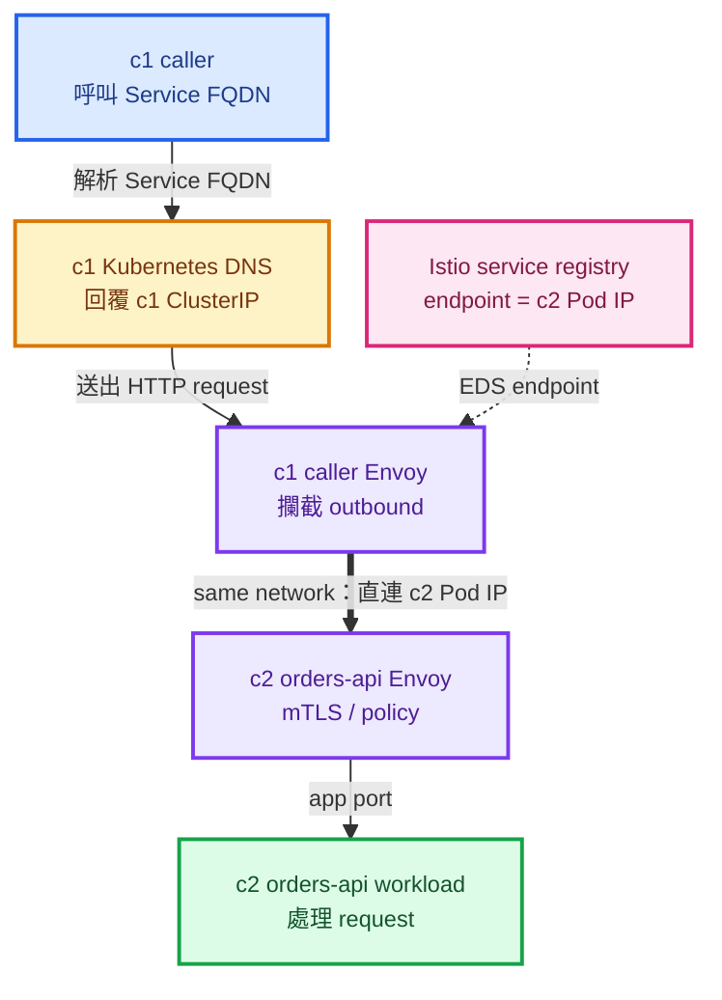
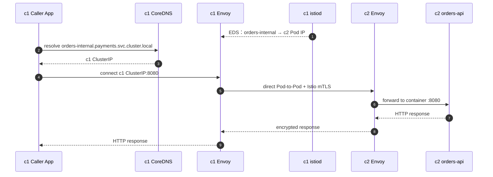
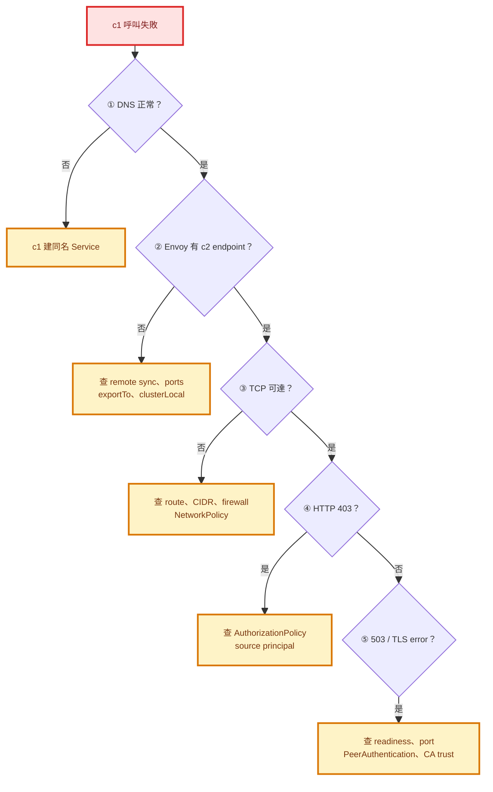

# Istio Multi-Primary Same Network：從 c1 透過 Internal Service 存取只存在 c2 的 Workload

> 🎯 **目標**：c1 裡的應用程式呼叫內部網址 `orders-internal.payments.svc.cluster.local:8080`，流量實際抵達只部署在 c2 的 `orders-api` Pod。
>
> 📌 **本文不包含** Istio multiple-primary mesh 的安裝。本文假設 mesh 已建好，只提供達成目標的 SOP、驗證方式與故障排除。

## 先看答案

需要做的事其實只有三件：

| # | 動作 | 目的 | 完成判斷 |
|---:|---|---|---|
| 1 | 在 **c1 與 c2 建立同名、同 namespace、同 port 定義的 ClusterIP Service** | c1 必須有 DNS；Istio 才能把兩邊辨識成同一個 mesh service | 兩邊都有 `orders-internal.payments` |
| 2 | **Deployment 只建立在 c2** | 讓這個 service 的唯一健康 endpoint 位於 c2 | c1 無後端 Pod；c2 Pod 為 `2/2 Running` |
| 3 | 從 c1 caller 的 Envoy 確認 c2 Pod IP，再用 Service FQDN 發 request | 證明 endpoint discovery 與實際資料流都正常 | Envoy 顯示 c2 Pod IP，HTTP 呼叫成功 |

> 🟢 **關鍵觀念**：c1 的 ClusterIP 不會被路由到 c2。它只是讓 c1 的 DNS lookup 成功，並成為 sidecar 攔截流量的入口。真正的目的地由 Envoy 從 Istio service registry 選出；在本例中，它會直接連 c2 Pod IP。

## Who / What / Where / Why / When

| 問題 | 白話說明 |
|---|---|
| **Who** | c1 的 caller Pod、caller sidecar、c1 istiod、c2 的 `orders-api` Pod |
| **What** | 用 Kubernetes internal Service 名稱呼叫遠端叢集 workload |
| **Where** | DNS 與 ClusterIP 在 c1；唯一 workload 與實際 endpoint 在 c2 |
| **Why** | Kubernetes DNS 只認得本叢集 Service；Istio 則能合併同一個 mesh 內、同名同 namespace 的 Service endpoints |
| **When** | `multi-primary + same network + single mesh`，而且兩個叢集的 Pod IP 能直接互通時 |

## Istio 版本支援矩陣

> 📅 **判定日期：2026-08-13**
>
> 下表把「SOP 的功能相容性」與「Istio 社群是否仍提供安全修補」分開判斷。**功能能運作，不等於該版本仍適合繼續跑 production。**

### 快速結論

| Istio 版本 | 核心跨叢集流程 | 本 SOP 能否直接使用 | 必要調整 | 官方維護狀態 | 建議 |
|---|:---:|:---:|---|---|---|
| **1.13.5** | 🟢 支援 | 🟡 調整後支援 | Step 6 的 `AuthorizationPolicy` 改成 `security.istio.io/v1beta1`；使用 1.13.5 `istioctl` | 🔴 已 EOL（2022-10-12） | 僅作 legacy 維運；排程升級，不應因 SOP 可用就忽略安全風險 |
| **1.24.0** | 🟢 支援 | 🟢 支援 | YAML 不必改；使用 1.24.0 `istioctl` | 🔴 已 EOL（2025-06-24） | 功能可用但不建議維持在 `.0`；應升到仍受支援的 minor release |
| **1.29.4** | 🟢 支援 | 🟢 支援 | 無；建議使用 1.29.4 `istioctl`，並評估更新到 1.29 最新 patch | 🟢 截至判定日仍受支援；預計約 2026-08 EOL | 三者中最適合直接採用；同時準備下一個 minor upgrade |

狀態圖例：🟢 可用／支援；🟡 需修改或有明顯限制；🔴 已停止官方維護。

### SOP 功能逐項對照

| SOP 依賴的能力 | 1.13.5 | 1.24.0 | 1.29.4 |
|---|:---:|:---:|:---:|
| Multi-primary、same-network endpoint discovery | ✅ | ✅ | ✅ |
| 同名／同 namespace Service 合併 | ✅ | ✅ | ✅ |
| c1、c2 都建 Service 以確保 DNS 成功 | ✅ | ✅ | ✅ |
| Same network 直接 Pod-to-Pod | ✅ | ✅ | ✅ |
| `istioctl remote-clusters` | ✅ | ✅ | ✅ |
| `istioctl proxy-config endpoints --cluster ...` | ✅ | ✅ | ✅ |
| Service annotation `networking.istio.io/exportTo` | ✅ | ✅ | ✅ |
| `MeshConfig.serviceSettings[].settings.clusterLocal` | ✅ | ✅ | ✅ |
| `AuthorizationPolicy` 的 `principals`、`ports` | ✅ | ✅ | ✅ |
| `security.istio.io/v1` | ❌ | ✅ | ✅ |
| 本 SOP 的 sidecar 驗證方式 | ✅ | ✅ | ✅ |

> **矩陣閱讀重點**
>
> - 三個版本都能讓 istiod 觀察 remote cluster endpoints，並合併同名、同 namespace 的 Service。
> - Kubernetes DNS 仍以本叢集 Service 為準，因此 c1、c2 都要建立 Service。
> - Same network 的正常結果是 caller Envoy 直接看到 c2 Pod IP，而不是 east-west gateway IP。
> - `remote-clusters` 自 Istio 1.12 起已從 experimental 移到 top-level；三版都能使用本文的 endpoint 檢查方式。
> - `security.istio.io/v1` 從 Istio 1.22 起可用；1.13.5 的 `AuthorizationPolicy` 必須改用 `v1beta1`。
> - 本文採 sidecar mode；不是 ambient mode SOP。

### Kubernetes 版本也要一起核對

| Istio | 當時官方支援的 Kubernetes 版本 | 對本 SOP 的影響 |
|---|---|---|
| 1.13.x | 1.20～1.23 | 若實際 Kubernetes 比這更新很多，即使 SOP 功能看似正常，整體組合仍屬官方未支援 |
| 1.24.x | 1.28～1.31 | `kubectl get endpointslice` 可直接使用 |
| 1.29.x | 1.31～1.35 | `1.29.4+` 目前列在官方無已知 CVE 的 patch 範圍；仍建議追到同 minor 最新 patch |

> 🔴 **不要把 1.13.5、1.24.0、1.29.4 三個 control plane 混在同一個 multi-primary mesh。** 上表假設它們是三套不同環境。官方只允許很有限的 control-plane/data-plane skew；跨越多個 minor release 的 c1/c2 組合不在支援範圍。若 c1 與 c2 屬於同一 mesh，應先把兩邊對齊到相同 minor，最好連 patch 也一致。

### 各版本應使用的 AuthorizationPolicy API

```yaml
# Istio 1.13.5
apiVersion: security.istio.io/v1beta1
kind: AuthorizationPolicy
```

```yaml
# Istio 1.24.0、1.29.4
apiVersion: security.istio.io/v1
kind: AuthorizationPolicy
```

除了 `apiVersion`，本文 Step 6 使用的 `selector`、`principals` 與 `ports` 規則可維持不變。

## 最終資料流



> 🔴 **不要把 east-west gateway 畫進這條資料流。** Same network 的定義就是兩邊 workload 可以直接通訊；跨叢集資料流是 Pod-to-Pod。East-west gateway 是不同 network 架構的資料面需求，不是本 SOP 的必經點。

---

## SOP 使用的範例名稱

先把本文範例對應到你的環境；後續指令都沿用這些值。

| 項目 | 範例值 | 你要確認的事 |
|---|---|---|
| c1 kube context | `cluster1` | caller 所在叢集 |
| c2 kube context | `cluster2` | workload 所在叢集 |
| Service namespace | `payments` | **兩邊必須相同** |
| Service name | `orders-internal` | **兩邊必須相同** |
| Service port | `8080`，名稱 `http` | **兩邊 number 與 name 都必須相同** |
| Workload label | `app: orders-api` | c2 Service selector 要選得到 |
| 完整 Service FQDN | `orders-internal.payments.svc.cluster.local` | caller 跨 namespace 時建議使用 FQDN |

```bash
export CTX_C1=cluster1
export CTX_C2=cluster2
export SERVICE_NS=payments
export SERVICE_NAME=orders-internal
export SERVICE_PORT=8080
export CALLER_NS=frontend
export CALLER_POD=<c1-caller-pod-name>
```

> 🟡 `<...>` 是佔位符，執行前一定要換成真實值。

## Step 0：執行前檢查

這一節只驗證既有 mesh，不重新教你安裝 multicluster。

### 0.1 檢查這真的是 same network

| 檢查 | 必須成立 | 不成立時 |
|---|---|---|
| c1 Pod CIDR → c2 Pod CIDR 有路由 | 是 | 先處理 VPC peering、route table 或 CNI routing |
| c1 與 c2 的 Pod CIDR 不重疊 | 是 | 重疊位址無法可靠直連，需重新規劃網路 |
| Firewall / Security Group 允許 workload port | 是 | 開放 c1 Pod CIDR 到 c2 Pod CIDR 的必要 port |
| NetworkPolicy 允許來源 | 是 | 加入 c1 caller namespace、Pod 或 CIDR 規則 |
| 兩邊 Istio 被設定為同一 network | 是 | 交由 mesh 管理者修正；不要用 ServiceEntry 繞過 |

### 0.2 檢查 c1 istiod 看得到 c2

```bash
istioctl remote-clusters --context="${CTX_C1}"
```

預期 c2 顯示為已連線／已同步。也可以確認 c1 的 multicluster secret 存在：

```bash
kubectl --context="${CTX_C1}" -n istio-system get secret \
  -l 'istio/multiCluster=true'
```

| 結果 | 判讀 |
|---|---|
| c2 已同步 | 🟢 繼續 |
| 找不到 c2 或 secret | 🔴 停止；endpoint discovery 尚未完成，請 mesh 管理者處理 remote secret/API access |
| secret 存在但不同步 | 🟡 查 istiod log、API server reachability 與 secret credential |

### 0.3 檢查 caller 與 server 都在 mesh 內

```bash
kubectl --context="${CTX_C1}" -n "${CALLER_NS}" \
  get pod "${CALLER_POD}" -o jsonpath='{.spec.containers[*].name}{"\n"}'

kubectl --context="${CTX_C2}" -n "${SERVICE_NS}" \
  get pod -l app=orders-api
```

Sidecar mode 的預期結果：

| Pod | READY | containers 應包含 |
|---|---:|---|
| c1 caller | `2/2` | 應用程式 container、`istio-proxy` |
| c2 orders-api | `2/2` | `orders-api`、`istio-proxy` |

---

## Step 1：在 c1 與 c2 建立相同的 internal Service

建立 `orders-internal-service.yaml`：

```yaml
apiVersion: v1
kind: Service
metadata:
  name: orders-internal
  namespace: payments
  annotations:
    # 明確允許 mesh 內其他 namespace 看見此 Service。
    # Istio 預設通常已是全域可見；若平台有自訂 defaultServiceExportTo，
    # 保留此設定可避免 frontend namespace 看不到 Service。
    networking.istio.io/exportTo: "*"
spec:
  type: ClusterIP
  selector:
    app: orders-api
  ports:
    - name: http
      protocol: TCP
      port: 8080
      targetPort: http
```

先確保兩邊都有相同 namespace，再把**同一份 Service manifest**套用到兩邊：

```bash
kubectl --context="${CTX_C1}" get namespace "${SERVICE_NS}"
kubectl --context="${CTX_C2}" get namespace "${SERVICE_NS}"

kubectl --context="${CTX_C1}" apply -f orders-internal-service.yaml
kubectl --context="${CTX_C2}" apply -f orders-internal-service.yaml
```

### 為什麼 c1 也要建 Service？

Kubernetes DNS 只根據本叢集的 Service 產生 DNS record。若 c1 沒有 `orders-internal` Service，caller 通常會在進入 Istio routing 之前就先遇到 `NXDOMAIN`。

| c1 的物件 | 要不要有 | 原因 |
|---|---:|---|
| `Service/orders-internal` | ✅ 要 | 提供 c1 DNS 與 ClusterIP |
| `Deployment/orders-api` | ❌ 不要 | workload 按需求只存在 c2 |
| 本地 EndpointSlice endpoint | ❌ 可以是空的 | 遠端 endpoint 由 Istio 下發給 Envoy，不會寫回 c1 Kubernetes EndpointSlice |
| `ServiceEntry` | ❌ 不要 | 這是同一個 mesh 內的 Kubernetes Service，不需要重複宣告 |
| `VirtualService` | ❌ 不需要 | 只有 c2 endpoint 時，Envoy 自然只會選 c2 |

### 比對兩邊 Service 身分

```bash
kubectl --context="${CTX_C1}" -n "${SERVICE_NS}" get svc "${SERVICE_NAME}" -o yaml
kubectl --context="${CTX_C2}" -n "${SERVICE_NS}" get svc "${SERVICE_NAME}" -o yaml
```

必須一致與可以不同的欄位如下：

| 欄位 | 是否必須一致 | 說明 |
|---|---:|---|
| `metadata.name` | ✅ | Istio service identity 的一部分 |
| `metadata.namespace` | ✅ | namespace sameness 的必要條件 |
| `ports[].port` | ✅ | Service port 必須相同 |
| `ports[].name` | ✅ | 相同 port number 的名稱也應相同，才能合併成同一 service port |
| protocol / application protocol | ✅ 建議 | 避免 protocol sniffing 或路由行為不一致 |
| `clusterIP` | ❌ | 每個 Kubernetes cluster 會分配自己的 ClusterIP，這是正常現象 |
| selector | ✅ 建議 | 使用同一份 manifest 最不容易 drift；selector 只會選本叢集 Pod |

---

## Step 2：只在 c2 建立 workload

如果 Deployment 已存在，確認它只部署在 c2，並跳到 Step 3。以下是最小化範例：

```yaml
apiVersion: v1
kind: ServiceAccount
metadata:
  name: orders-api
  namespace: payments
---
apiVersion: apps/v1
kind: Deployment
metadata:
  name: orders-api
  namespace: payments
spec:
  replicas: 2
  selector:
    matchLabels:
      app: orders-api
  template:
    metadata:
      labels:
        app: orders-api
    spec:
      serviceAccountName: orders-api
      containers:
        - name: orders-api
          image: ghcr.io/your-org/orders-api:v1 # 換成你的 image
          ports:
            - name: http
              containerPort: 8080
          readinessProbe:
            httpGet:
              path: /readyz
              port: http
            periodSeconds: 5
```

只套用到 c2：

```bash
kubectl --context="${CTX_C2}" apply -f orders-api-deployment.yaml
kubectl --context="${CTX_C2}" -n "${SERVICE_NS}" \
  rollout status deployment/orders-api
```

確認 c1 沒有 workload、c2 有健康 workload：

```bash
kubectl --context="${CTX_C1}" -n "${SERVICE_NS}" \
  get pod -l app=orders-api -o wide

kubectl --context="${CTX_C2}" -n "${SERVICE_NS}" \
  get pod -l app=orders-api -o wide
```

| Cluster | 預期 |
|---|---|
| c1 | `No resources found` |
| c2 | 至少一個 `2/2 Running` 且 `READY 1/1` 的應用 endpoint |

> 🟡 Kubernetes Pod 的 `READY` 顯示可能是 `2/2`；EndpointSlice 的 endpoint readiness 則應為 `true`。若 readiness probe 失敗，Istio 不應把它當成可用 endpoint。

---

## Step 3：先驗證 c2 的 Kubernetes endpoint

```bash
kubectl --context="${CTX_C2}" -n "${SERVICE_NS}" \
  get endpointslice \
  -l "kubernetes.io/service-name=${SERVICE_NAME}" -o wide
```

取得 c2 Pod IP，後面用來核對 Envoy：

```bash
export C2_POD_IP=$(kubectl --context="${CTX_C2}" -n "${SERVICE_NS}" \
  get pod -l app=orders-api \
  -o jsonpath='{.items[0].status.podIP}')

echo "${C2_POD_IP}"
```

再看 c1 本地 EndpointSlice：

```bash
kubectl --context="${CTX_C1}" -n "${SERVICE_NS}" \
  get endpointslice \
  -l "kubernetes.io/service-name=${SERVICE_NAME}" -o wide
```

> 🔵 **c1 EndpointSlice 沒有 c2 Pod IP 是正常的。** Istio 不會把 remote endpoint 寫進 c1 的 Kubernetes API；應以 caller Envoy 的 endpoint view 為準。

---

## Step 4：確認 c1 caller Envoy 已收到 c2 endpoint

先用完整 cluster key 查詢：

```bash
istioctl --context="${CTX_C1}" proxy-config endpoints \
  "${CALLER_POD}.${CALLER_NS}" \
  --cluster "outbound|${SERVICE_PORT}||${SERVICE_NAME}.${SERVICE_NS}.svc.cluster.local"
```

預期會看到類似結果：

```text
ENDPOINT             STATUS   OUTLIER CHECK   CLUSTER
10.42.20.37:8080     HEALTHY  OK              outbound|8080||orders-internal.payments.svc.cluster.local
```

核對表：

| 檢查 | 正確結果 |
|---|---|
| endpoint IP | 等於某個 c2 `orders-api` Pod IP |
| endpoint port | `8080` |
| status | `HEALTHY` |
| endpoint 是 east-west gateway IP | **否**；same network 應看到 remote Pod IP |
| endpoint 出現 c1 Pod IP | **否**；本例 c1 沒有 workload |

若想看 endpoint 的 cluster metadata：

```bash
istioctl --context="${CTX_C1}" proxy-config endpoints \
  "${CALLER_POD}.${CALLER_NS}" \
  --cluster "outbound|${SERVICE_PORT}||${SERVICE_NAME}.${SERVICE_NS}.svc.cluster.local" \
  -o json
```

在 JSON 裡確認 endpoint 的 locality / metadata 指向 c2。不同 Istio 版本的輸出欄位可能不同，因此 **Pod IP 比對是最直接的判斷方式**。

---

## Step 5：從 c1 透過 internal Service 發 request

先驗證 DNS：

```bash
kubectl --context="${CTX_C1}" -n "${CALLER_NS}" \
  exec "${CALLER_POD}" -c <caller-app-container> -- \
  getent hosts "${SERVICE_NAME}.${SERVICE_NS}.svc.cluster.local"
```

預期回覆的是 **c1 的 ClusterIP**。接著用相同 Service FQDN 發 request：

```bash
kubectl --context="${CTX_C1}" -n "${CALLER_NS}" \
  exec "${CALLER_POD}" -c <caller-app-container> -- \
  curl -sv --connect-timeout 3 --max-time 10 \
  "http://${SERVICE_NAME}.${SERVICE_NS}.svc.cluster.local:${SERVICE_PORT}/healthz"
```

| 驗收項目 | Pass 條件 |
|---|---|
| DNS | 能解析，回 c1 ClusterIP |
| HTTP | 回應服務定義的成功狀態，例如 `200` |
| Server log | c2 `orders-api` 看得到 request |
| c1 workload | 仍然不存在 |
| Envoy endpoint | 唯一或全部健康 endpoint 都位於 c2 |

查看 c2 server log：

```bash
kubectl --context="${CTX_C2}" -n "${SERVICE_NS}" \
  logs -l app=orders-api -c orders-api --tail=100
```

### Request 的完整時序



---

## Step 6：若有 AuthorizationPolicy，允許 c1 caller 身分

Istio 的 workload identity 以 trust domain、namespace 與 ServiceAccount 為主，不以 cluster name 區分。假設 c1 caller 使用 `frontend-sa`，可以在 `payments` namespace 建立明確 allow policy：

> 🟡 下列 YAML 適用 Istio 1.24.0 與 1.29.4。**Istio 1.13.5 請只把第一行改為 `apiVersion: security.istio.io/v1beta1`**，其餘規則不變。

```yaml
apiVersion: security.istio.io/v1
kind: AuthorizationPolicy
metadata:
  name: allow-frontend-to-orders
  namespace: payments
spec:
  selector:
    matchLabels:
      app: orders-api
  action: ALLOW
  rules:
    - from:
        - source:
            principals:
              - "cluster.local/ns/frontend/sa/frontend-sa"
      to:
        - operation:
            ports: ["8080"]
```

把 policy 套用到 workload 所在的 c2：

```bash
kubectl --context="${CTX_C2}" apply -f allow-frontend-to-orders.yaml
```

> 🟡 若 mesh 使用自訂 `trustDomain`，請把 `cluster.local` 換成實際值。若 namespace 已存在其他 `ALLOW` policy，也要一起檢查規則的聯集結果。

---

## 不需要建立的東西

| 元件 | 本案例要不要 | 原因 |
|---|---:|---|
| LoadBalancer Service | ❌ | 服務只在 mesh 內使用 |
| NodePort | ❌ | same network 直接使用 Pod IP |
| Ingress Gateway | ❌ | 不是外部進站流量 |
| East-West Gateway 資料路徑 | ❌ | same network 是跨叢集 Pod-to-Pod |
| ServiceEntry | ❌ | Istio 已從兩個 Kubernetes registry 合併 service/endpoints |
| ExternalName | ❌ | 不需要繞 DNS 或指到外部名稱 |
| VirtualService | ❌ | 只有 c2 endpoint，不必額外指定路由 |
| DestinationRule 的 c2 subset | ❌ 通常不用 | 沒有 c1 endpoint 時自然只會走 c2；不要增加不必要設定 |

## 常見阻擋：`clusterLocal`

即使 endpoint discovery 正常，MeshConfig 若把該 service 設為 `clusterLocal: true`，c1 仍不會使用 c2 endpoint。

請 mesh 管理者檢查 `MeshConfig.serviceSettings` 是否命中以下任一種規則：

| 可能規則 | 影響 |
|---|---|
| `orders-internal.payments.svc.cluster.local` | 只擋此 service 的跨叢集 endpoint |
| `*.payments.svc.cluster.local` | 擋整個 `payments` namespace |
| `*` | 預設擋全 mesh 的跨叢集 endpoint |

若平台採「預設 cluster-local、個別放行」，加入精確例外：

```yaml
meshConfig:
  serviceSettings:
    - settings:
        clusterLocal: false
      hosts:
        - "orders-internal.payments.svc.cluster.local"
```

這是 control plane 層級變更，請走平台既有的 Istio 發版流程，不要直接手改線上 ConfigMap。

---

## 故障排除決策圖



> 🟡 任一黃色節點修正完成後，都回到 **Step 4、Step 5** 重新驗證。若錯誤不屬於圖中的狀況，再查應用程式的 path、timeout 與 server log。

### 症狀對照表

| 症狀 | 最可能原因 | 第一個檢查 | 修正方向 |
|---|---|---|---|
| `Could not resolve host` / `NXDOMAIN` | c1 沒有 Service，或名稱/namespace 錯 | c1 `kubectl get svc` | 把相同 Service 建在 c1，使用正確 FQDN |
| c1 Envoy 查不到 cluster | caller 沒 sidecar、service visibility 被限制、Sidecar egress scope 排除 | `proxy-config clusters`、Pod containers | 修正 injection、`exportTo` 或 `Sidecar.egress.hosts` |
| cluster 存在但沒有 endpoint | remote discovery 未同步、Service identity/port 不一致、`clusterLocal` | `remote-clusters`、比對兩邊 Service YAML | 修 remote sync；統一 name/ns/port；解除 cluster-local |
| endpoint 是 c2 Pod IP，但 timeout | L3/L4 不通 | c1 到 c2 Pod IP `nc -vz` | 修 route、firewall、SG、NetworkPolicy |
| HTTP `403` | AuthorizationPolicy 拒絕 | c2 proxy access log / policy | 放行正確 ServiceAccount principal |
| `503 no healthy upstream` | c2 Pod not ready 或 port 錯 | c2 EndpointSlice、readiness probe | 修 readiness、selector、targetPort |
| `503 UF` / TLS error | CA trust、PeerAuthentication 或 sidecar 問題 | `istioctl proxy-config secret`、proxy logs | 統一 trust；確認兩邊 proxy 正常 |
| 看到 east-west gateway IP | cluster/network topology 被判定為不同 network | endpoint output、network labels | 核對兩邊 network 設定；不要假設仍是 same network |
| c1 EndpointSlice 是空的 | **正常** | 改查 caller Envoy endpoints | 不需修 Kubernetes EndpointSlice |

### 檢查 TCP 可達性

如果 Envoy 已看到 c2 Pod IP，但呼叫 timeout，可從 c1 caller container 做最小 L4 測試：

```bash
kubectl --context="${CTX_C1}" -n "${CALLER_NS}" \
  exec "${CALLER_POD}" -c <caller-app-container> -- \
  nc -vz -w 3 "${C2_POD_IP}" "${SERVICE_PORT}"
```

若 image 沒有 `nc`，使用組織核准的 debug container/image。不要為了測試把 internal Service 改成 LoadBalancer。

### 檢查 proxy 狀態與設定同步

```bash
istioctl --context="${CTX_C1}" proxy-status

istioctl --context="${CTX_C1}" proxy-config clusters \
  "${CALLER_POD}.${CALLER_NS}" \
  --fqdn "${SERVICE_NAME}.${SERVICE_NS}.svc.cluster.local"
```

caller proxy 應為 `SYNCED`，而 service cluster 類型通常由 EDS 提供 endpoint。

---

## 最終驗收 Checklist

| 狀態 | 驗收項目 |
|:---:|---|
| ⬜ | c1 與 c2 的 Service name、namespace、port number、port name 一致 |
| ⬜ | c1 有 ClusterIP Service，但沒有 `orders-api` Pod |
| ⬜ | c2 有健康 `orders-api` Pod 與本地 EndpointSlice |
| ⬜ | c1 caller 與 c2 server 都已注入 sidecar |
| ⬜ | c1 istiod 的 remote cluster 狀態包含 c2 且已同步 |
| ⬜ | c1 caller Envoy 的 endpoint 是 c2 Pod IP，不是 gateway IP |
| ⬜ | c1 可直接連線到 c2 Pod IP 的 workload port |
| ⬜ | 該 FQDN 沒被 `clusterLocal: true` 擋住 |
| ⬜ | `exportTo` / Sidecar egress scope 允許 caller namespace 看見 service |
| ⬜ | AuthorizationPolicy 允許 c1 caller ServiceAccount |
| ⬜ | 從 c1 使用 Service FQDN 呼叫成功，c2 server log 有 request |

## 一句話心智模型

```text
c1 Service 負責「讓名稱存在」，Istio 負責「把名稱對到 c2 endpoint」，
same network 負責「讓 c1 Envoy 直接連得到 c2 Pod IP」。
```

## 官方參考資料

- [Istio：Supported Releases（包含維護狀態、EOL 與 Kubernetes 相容範圍）](https://istio.io/latest/docs/releases/supported-releases/)
- [Istio 1.22：Istio APIs promoted to v1](https://istio.io/latest/news/releases/1.22.x/announcing-1.22/)
- [Istio 1.12 Change Notes：remote-clusters 移至 top-level](https://istio.io/latest/news/releases/1.12.x/announcing-1.12/change-notes/)
- [Istio 1.13 Upgrade Notes：multicluster endpoint discovery 相關變更](https://istio.io/latest/news/releases/1.13.x/announcing-1.13/upgrade-notes/)
- [Istio 1.24 EOL announcement](https://istio.io/latest/news/support/announcing-1.24-eol-final/)
- [Istio 1.29.4 release notes](https://istio.io/latest/news/releases/1.29.x/announcing-1.29.4/)
- [Istio：Install Multi-Primary（same network）](https://istio.io/latest/docs/setup/install/multicluster/multi-primary/)
- [Istio：Verify the multicluster installation](https://istio.io/latest/docs/setup/install/multicluster/verify/)
- [Istio：Deployment Models 與 namespace sameness](https://istio.io/latest/docs/ops/deployment/deployment-models/)
- [Istio：Troubleshooting Multicluster](https://istio.io/latest/docs/ops/diagnostic-tools/multicluster/)
- [Istio：Multi-cluster Traffic Management 與 clusterLocal](https://istio.io/latest/docs/ops/configuration/traffic-management/multicluster/)
- [Istio：Configuration Scoping 與 exportTo](https://istio.io/latest/docs/ops/configuration/mesh/configuration-scoping/)
- [Istio：istioctl command reference](https://istio.io/latest/docs/reference/commands/istioctl/)
